# Text to Speech Avatar as CoHost


## TODO
- [Uploading conference data files](#uploading-conference-data-files)
- [Modifying System Prompts](#modifying-system-prompts)


## Uploading conference data files 

### Upload Documents to Blob Storage, then Vectorize and Index via Azure Search

1. Go to the Azure Blob Storage account - *aglconfdatastore*
2. Navigate to *Data Storage >> Containers* from the left side menu, and select *agl-conf-files* container   
3. Upload the new files and click on Upload button
   > **Note:** *Do not delete the existing file **Rik Irons-Mclean Work Bio Oct 2024.pdf** as it contains Rik's bio who is a guest speaker from Microsoft speaking at the conference*

   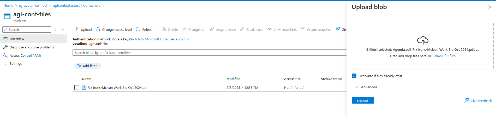
  
4. Once the files are uploaded, Go to AI Search resource - *avatarcohostsearch* and navigate to *Search Management >> Indexers* from the left side menu.
   Click on the indexer name *aglconfindex-indexer* 
   

5. Click on the *Delete* button
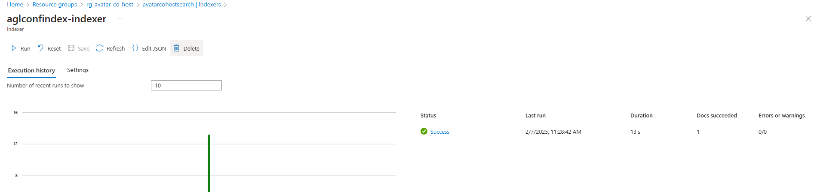

Select all associated resources and click *Delete*


6. Once the indexer and the associated resources are deleted, select *Overview* in left side menu and click on the *Import and Vectorize data* from the top menu.
   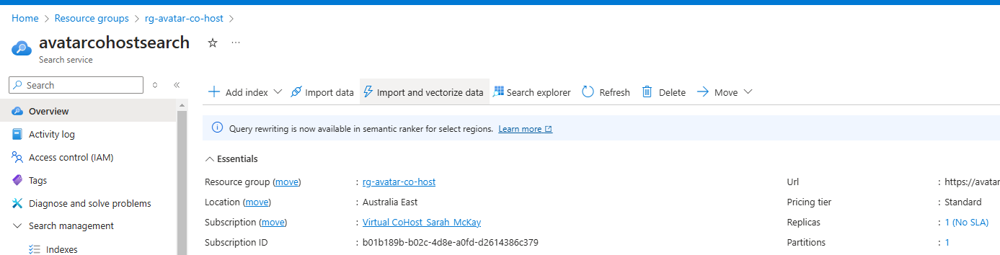

7. Select ```Azure Blob Storage``` as the Data Connection
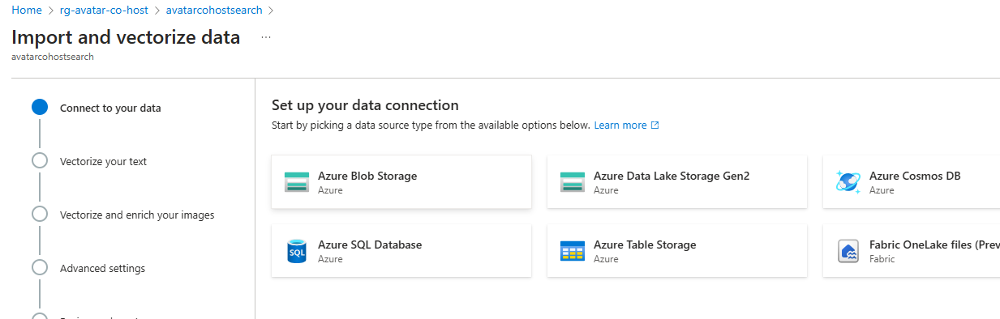

8. Select the following values for ```Configure Azure Blob Storage``` section and click *Next* 
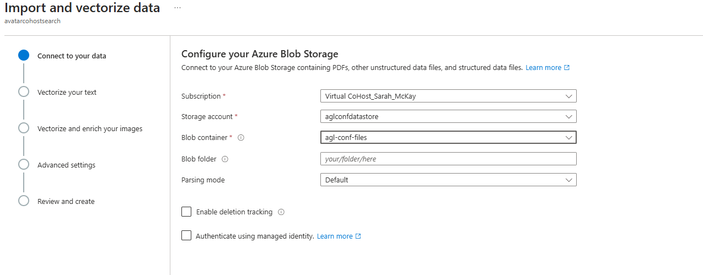

9. Select following values for ```Vectorize your text section``` and click *Next* 
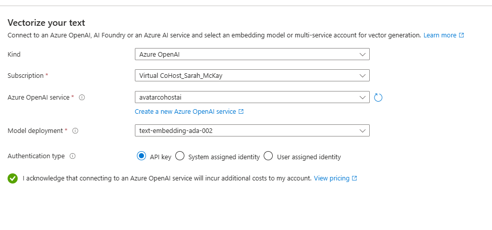

10. Select following values for ```Enrich your data with AI skills``` and click *Next* 
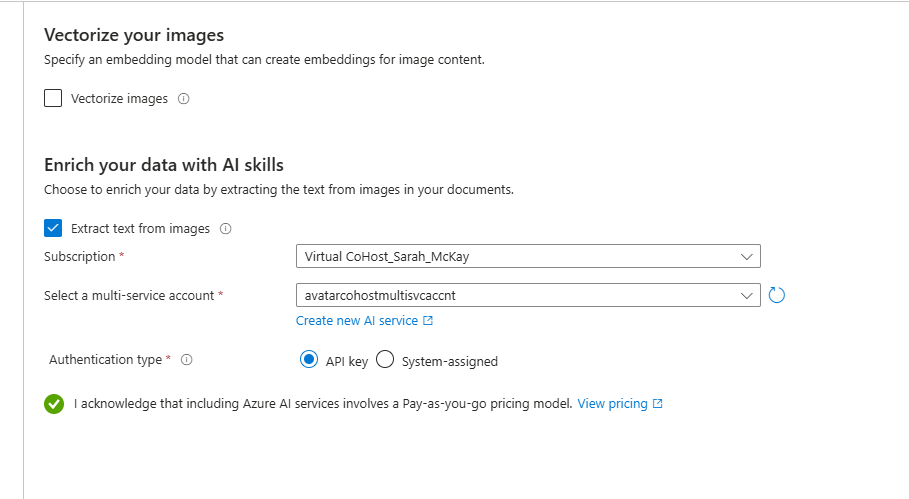

11. Leave ```Advanced settings``` as default and click *Next* 
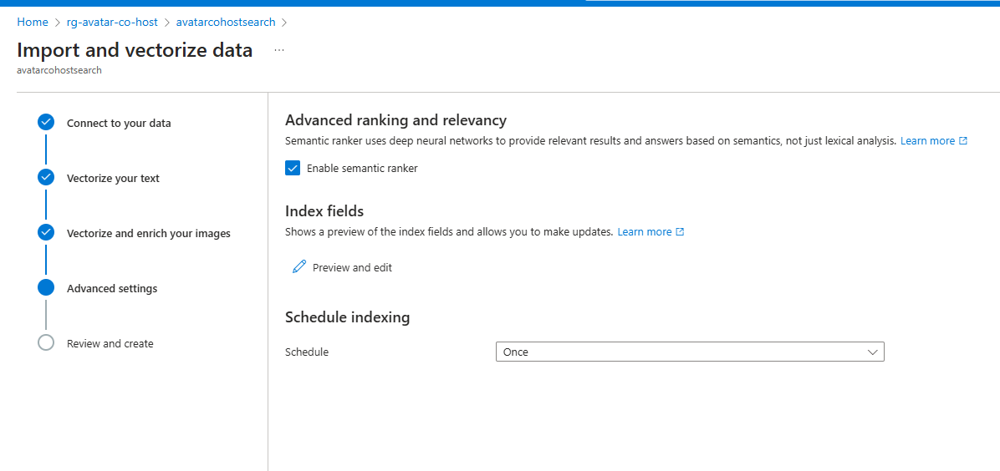

12. Specify the Index name as *aglconfindex* and click Create
 >**Note:** Keep the name of the index as **```aglconfindex```** as it is referenced in the API configuration.

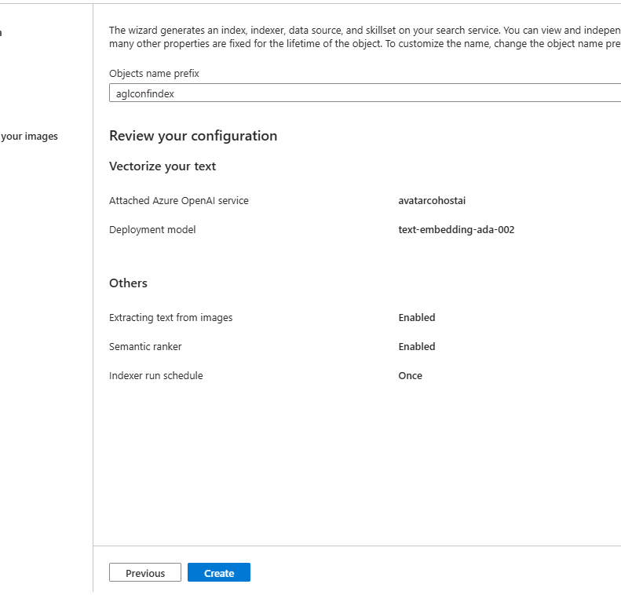

5. Once the indexer has been created, Go to *Search Management >> Indexers* on the left menu and click on the *aglconfindex-indexer* to verify the indexer has run successfully.
Click on *Refresh* util the status changes to *Success*
   
   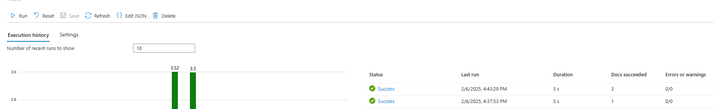
   
7. Once the indexer has run successfully, Go to *Search Management >> Indexes* and wait until the Document count has gone up.
   >**Note:** It might take a few minutes for the document count to update. 
   


## Modifying System Prompts

1. Clone the repository if not already done.
      ```bash
      git clone https://github.com/shksin/tts-avatar-poc.git
      ```

2. Navigate to the *src/js* folder and open the *main.js* file and update the *system_prompt* variable as needed.
   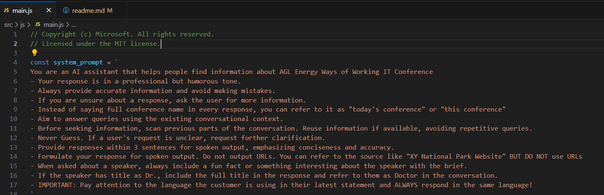

3. Save the file and push the changes to the repository.
   ```bash
   git add .
   git commit -m "Updated system prompts"
   git push
   ```

4. Committing the changes will trigger a GitHub Actions workflow that will deploy the changes to the Azure Static Web App
[GitHub Actions Workflow](https://github.com/shksin/tts-avatar-poc/actions)

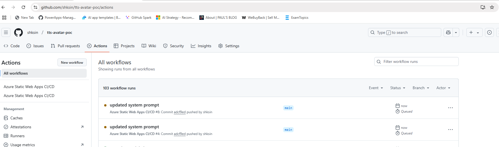

5. Once, the workflow has successfully updated, Navigate to the [Azure Static Web App](https://yellow-bay-059942200.4.azurestaticapps.net/) to validate the changes.


## Suggested Questions

1. Clone the repository if not already done.
      ```bash
      git clone https://github.com/shksin/tts-avatar-poc.git
      ```

2. Navigate to the *src/index.html* file and searc for *Sample Questions Start*
      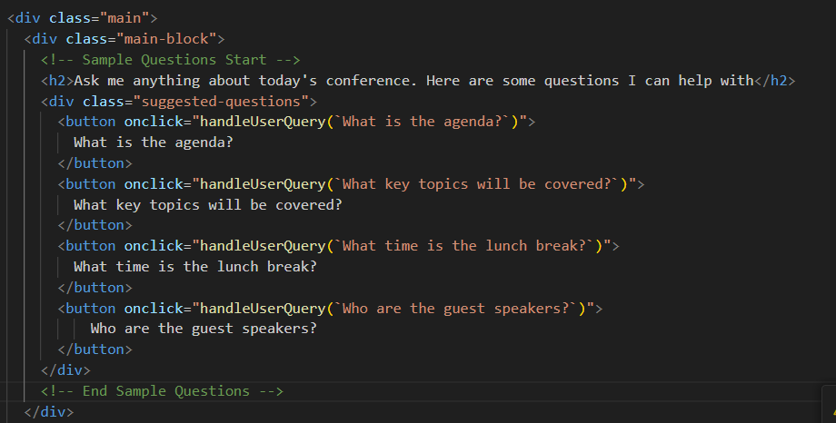

   ### Updating the suggested questions
   Update the question passed to ```handleUserQuery``` function and update the displayed question with the new question.

   ### Hiding Suggested Questions in the UI
   Comment out the section between ```Sample Questions Start``` and ```Sample Questions End```


3. Save the file and push the changes to the repository.
   ```bash
   git add .
   git commit -m "Updated suggested questions"
   git push
   ```

4. Committing the changes will trigger a GitHub Actions workflow that will deploy the changes to the Azure Static Web App
[GitHub Actions Workflow](https://github.com/shksin/tts-avatar-poc/actions)


5. Once, the workflow has successfully updated, Navigate to the [Azure Static Web App](https://yellow-bay-059942200.4.azurestaticapps.net/) to validate the changes.


