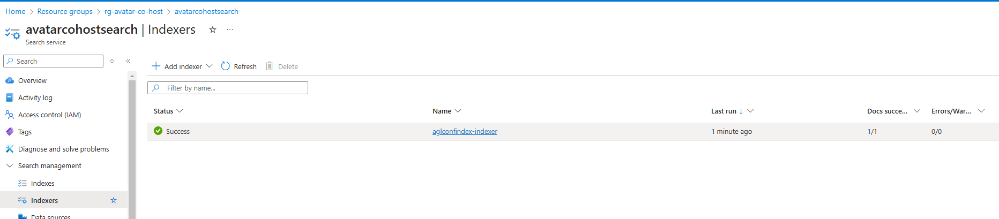
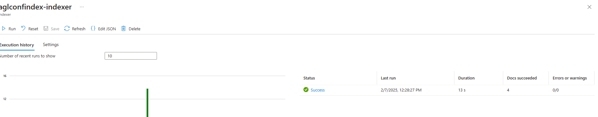
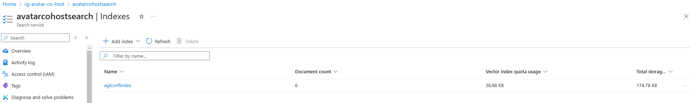

# Text to Speech Avatar as CoHost


## TODO
- [Uploading conference data files](#uploading-conference-data-files)
- [Modifying System Prompts](#modifying-system-prompts)


## Uploading conference data files 

### Upload Documents to Blob Storage, then Vectorize and Index via Azure Search

1. Go to the Azure Blob Storage account - *aglconfdatastore*
2. Navigate to *Data Storage >> Containers* from the left side menu, and select *agl-conf-files* container   
3. Upload the new files and click on Upload button
   > **Note:** *Do not delete the existing file **Rik Irons-Mclean Work Bio Oct 2024.pdf** as it contains Rik's bio who is a guest speaker from Microsoft speaking at the conference*

   
  
4. Once the files are uploaded, Go to AI Search resource - *avatarcohostsearch* and navigate to *Search Management >> Indexers* from the left side menu.
   Click on the indexer name *aglconfindex-indexer* 
   

5. Click on the *Reset* button
   
   Click *Refresh* and make sure Reset is done
   
   
6. Then Click the *Run* button to run the Indexer
   
   Click *Refresh* and wait until all the new docs are successfully indexed.

   

7. Once the indexer has run successfully, Go to *Search Management >> Indexes* and wait until the Document count has gone up.
   >**Note:** It might take a few minutes for the document count to update. 
   
   


## Modifying System Prompts

1. Clone the repository if not already done.
      ```bash
      git clone https://github.com/shksin/tts-avatar-poc.git
      ```

2. Navigate to the *src/js* folder and open the *main.js* file and update the *system_prompt* variable as needed.
   

3. Save the file and push the changes to the repository.
   ```bash
   git add .
   git commit -m "Updated system prompts"
   git push
   ```

4. Committing the changes will trigger a GitHub Actions workflow that will deploy the changes to the Azure Static Web App
[GitHub Actions Workflow](https://github.com/shksin/tts-avatar-poc/actions)


5. Once, the workflow has successfully updated, Navigate to the [Azure Static Web App](https://yellow-bay-059942200.4.azurestaticapps.net/) to validate the changes.


