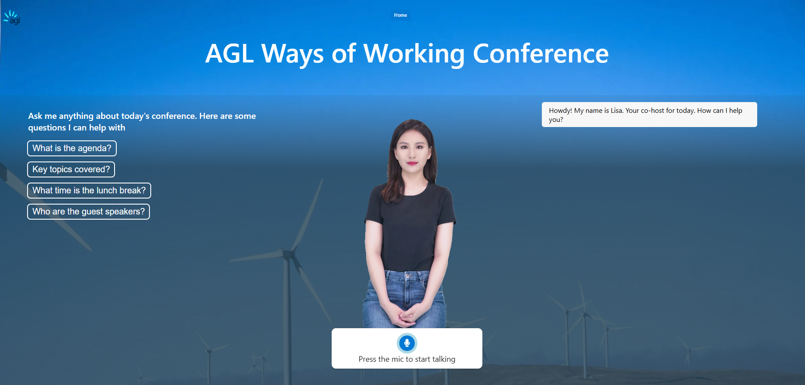
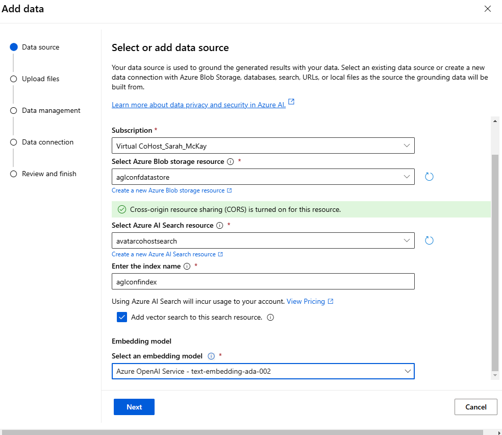
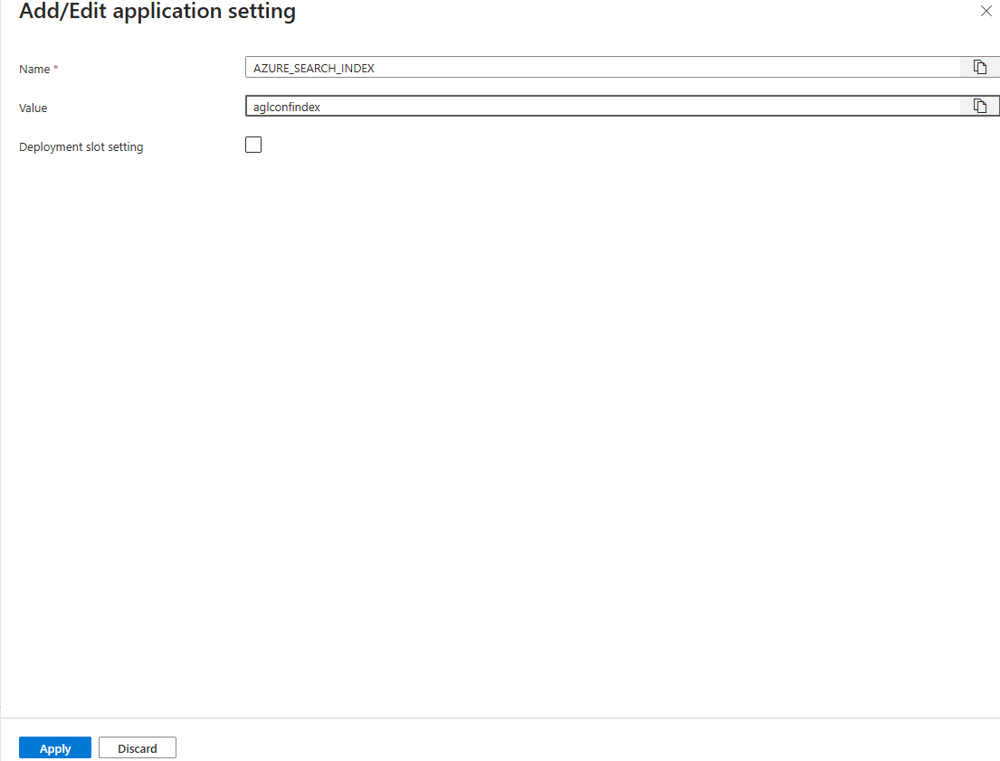

# Text to Speech Avatar as CoHost

## Uploading content to Azure OpenAI for Avatar CoHost to use as grounding data

### 1. Upload Documents and Create Index via Azure AI Foundry Portal

The quickest way to do this via Azure AI Foundry Portal. Follow the steps below to create a new index:

1. Select your Azure OpenAI resource - *avatarcohostai*
2. Click on the *Go To Azure AI Foundry Portal* button
3. On the Azure AI Foundry Portal, go to *Playgrounds >> Chat* from the right side menu
4. On the playground page, select Add your data and click on the *Add a data source* button
   
5. Select following values in the dropdown and give a name to the index.
   > **Note:** Note the name of the index specified here, as we will need it to update the Environment variables in the Azure Functions app.

   
6. Click *Next* and upload the files
   
7. Click on *Upload files* button, the files should upload successfully.
   
8. Click on the *Next* button. On the Data Management page, keep the default selection and click on the *Next* button.
9. On the Data connection page, select authentication type as the *API key* and click on the *Next* button.
   
10. Review the settings and click on the *Save and close* button
    

### 2: Configure the index in the Azure Function App

1. Go to the Azure Function App - *avatarcohostapi*
2. Select *Settings >> Environment variables* from the left side menu   

3. Click on the *AZURE_SEARCH_INDEX* environment variable and update the value with the name of the index created in the previous step. Click on the *Apply* button on this screen.

4. Click on the *Apply* button on the main page of Environment Variables to save the changes.

5. Function App will ask restart to apply the changes. Click *Confirm* 

